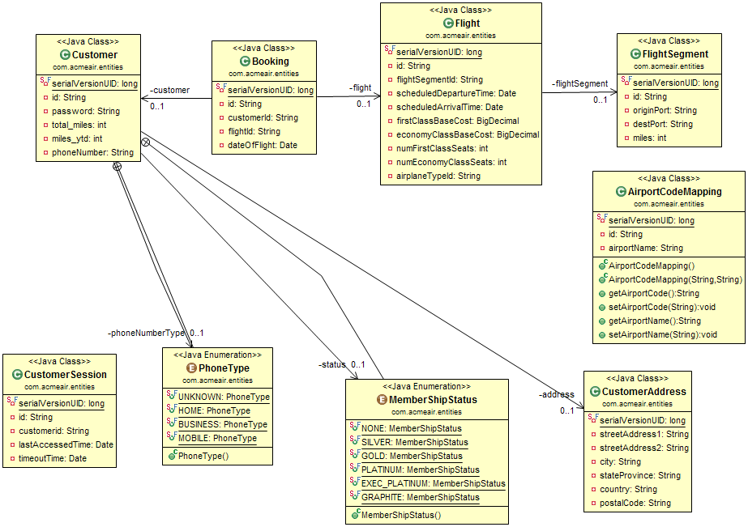

# Adding Additional Data Services to Acme Air


The architecture of Acme Air is very flexible and can be extended to include any number of additional services. 
These instructions outline some of the key components necessary for adding a new data service. 


## Acme Air architecture overview

### Entities 

#### Entity Model 

There are 7 Entity classes:
* AirportCodeMapping
* Booking
* CustomerAddress
* Customer
* CustomerSession
* Flight
* FlightSegment



#### Entity Interfaces

 The Entity Interfaces are located in the acme-common module.  The reason why only the interfaces are defined under acme-common, is each data service may have specific needs with the actual Entity classes.  For example JPA has its own Entity annotations that are required to define the entity classes.  Morphia (MongoDB)  has its own annotations.  Also, some of the Entities for WebSphere eXtreme Scale make use of the ObjectGrid PartitionableKey plugin.  In order to allow for the added flexibility of the implementation specific dependancies, it was best to keep the just the interfaces in acme-common so the web tier would be able to perform get / set operations on the data.  

### Services 
The acmeair-services module contains the classes that hold the business logic for the AcmeAir services.  There are three main service interface classes in the Acme Air application:
* BookingService - Creating new bookings and canceling existing bookings for a given customer.
* CustomerService - Creating and updating customer information, and managing the customers session 
* FlightService - Allows searching for flights by airports and/or departure dates, and searching for flight segments. 

Each of these classes have several abstract methods that need to be implemented for the specific service operations.


### The ServiceLocator 

The Acme Air ServiceLocator is the central 'brains' for connecting the web application's REST interfaces with the correct data service implementation.  
It does this by utilizing CDI's BeanManager that of the type of the same type as the requested abstract service class. It then checks to see if the DataService qualifier annotation of the service implementation matches the service type that was either set via JNDI (using the "com/acmeair/repository/type" jndi entry name) or by the VCAP_SERVICES environment variable in the case of Acme Air running in a Bluemix environment.  

In this way, more than one data service can be built in with the Acme Air application at one time, and can be switched between them using the JNDI entry. 


## Creating a Service Implementation 

### Implement the 7 Entity interfaces

### Implement the 3 Service classes 
The Three abstract services are FlightService, CustomerService, and BookingService
In addition to extending or implementing those three services, the DataService qualifier annotation needs to be applied, with the key name and description set.   DataService name will be the JNDI key that will be used for selecting which service is to be used. 

It is recommended to create an interface that will hold the String constants (Service name and description) use by each of the classes. 

Example for the CustomerService implementation class for the Morphia service:

```java 

import com.acmeair.service.DataService;
import com.acmeair.morphia.MorphiaConstants;

@DataService(name=MorphiaConstants.KEY,description=MorphiaConstants.KEY_DESCRIPTION)
public class CustomerServiceImpl extends CustomerService implements MorphiaConstants {	
```

And implement the abstract methods to handle the specific CRUD operations required. 

### Add the beans.xml file  

In order for your new service to be visible to the Acme Air service locator, a beans.xml file needs to be included in the .jar module. 
This file should be placed under src/main/java/resources/META_INF/beans.xml
If the beans.xml file is not included, Acme Air will not find your new service. 


